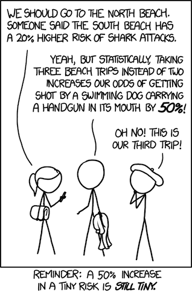

# Inferential Statistics
In our mod 1 project, we began looking at datasets (i.e. movie info) and made various observations. We considered the data as if we were looking at a complete picture of the movie industries. We introduced a few descriptive statistics such as measures of central tendency and outliers.

However, often in our work as data scientists, rarely will we have a dataset that encompases an entire population.  Instead, we will look at a sample of the population and make inferences about the greater population.  let's take a quick tour into inferential statistics. 

Consider these examples:

- A zoologist wanting to know the typical lifespan of a Siberian tiger
- A cosmologist wanting to know the mass of a normal white dwarf star
- A businesswoman wanting to know how many M&M's her customers should expect to find in their Party Size bags
- A botanist wanting to know how tall California redwoods usually grow

The zoologist could, in principle:

- keep track of every currently existing Siberian tiger;
- record their (more or less) exact ages at their moments of death;
- add up those ages and divide by the number of tigers to calculate an average lifespan

––But only in principle. In all of these situations, there is no realistic or practical opportunity to check each relevant data point.

What we can do, however, is to check some of the data points we want to check. That is, we'll draw a sample of data from our population of interest. We can then use the techniques of descriptive statistics to characterize our sample.

Does this help? The hope, of course, is that our sample will be representative of the population as a whole, which would justify our using facts about the sample to infer things about the population as a whole. But naturally we'll expect a certain amount of error: If I take the mean of a sample, $\bar{x}$ and project it as an estimate of the mean of the whole population, $\mu$, the estimate is bound to be imperfect.

Inferential statistics makes all this precise. 

This intro was adapted from Peter Norvig's pytude deck found [here]( https://github.com/gadamico/pytudes/blob/master/ipynb/Probability.ipynb). It is awesome. Check out the entire deck when you have a free moment.

To begin our weeklong journey into inferential statistics, we will begin with a brief visit to probability and a first stop at Set Theory.

## What is Set Theory?

"Set theory is the mathematical theory of well-determined collections, called sets, of objects that are called members, or elements, of the set." [$^1$](https://plato.stanford.edu/entries/set-theory/) 


### Why do we need to know what a set is?

_Probability_ and _statistics_ are based on counting the elements in sets and manipulating set operations.  We have touched on [similar concepts](https://www.w3schools.com/sql/sql_join.asp)  to some set operations in SQL.


Visualization of [Set Theory](https://seeing-theory.brown.edu/compound-probability/index.html#section1)


```python
S = set(range(1,20))


# In python, we define a set with curly braces.
# But unlike dictionaries, we don't use key value pairs.

A = {'r','o','y','g','b','i','v'} # colors of the rainbow
B = {'r','g','b'} # rgb base colors

# We can then use the methods union and intersection, as well as the & and | operators.
print(A.intersection(B) == A & B)

print(A.union(B) == A | B)

```

    True
    True


### *Activity:  We are trying to create buddies based on interest for a  trip. <br>
Who should buddy with whom based on interests?

This is another way to look at sets.<br>
And we can still use the math!


```python
pairs = {'Robin':{"art", "traveling", "wine", "doodling", "tech", "gadgets"},
        'Andy': {"rock-climbing", "traveling", "dad jokes", "ice cream"},
        'Alison':{"wine", "traveling", "schitts creek", "dogs"},
        'Sue': {"schitts creek", "dogs" "tarot card reading", "croquet", "taxonomy"},
        'Jim': {"ice cream", "dogs", "zookeeping", "traveling"},
         'Al':{"schitts creek", "tech", "dogs"}
        }
```


```python
from itertools import combinations
combos = list(combinations(list(pairs.keys()), 2))
for c in combos:
    print(c, pairs[c[0]].intersection(pairs[c[1]]))
```

    ('Robin', 'Andy') {'traveling'}
    ('Robin', 'Alison') {'traveling', 'wine'}
    ('Robin', 'Sue') set()
    ('Robin', 'Jim') {'traveling'}
    ('Robin', 'Al') {'tech'}
    ('Andy', 'Alison') {'traveling'}
    ('Andy', 'Sue') set()
    ('Andy', 'Jim') {'traveling', 'ice cream'}
    ('Andy', 'Al') set()
    ('Alison', 'Sue') {'schitts creek'}
    ('Alison', 'Jim') {'traveling', 'dogs'}
    ('Alison', 'Al') {'dogs', 'schitts creek'}
    ('Sue', 'Jim') set()
    ('Sue', 'Al') {'schitts creek'}
    ('Jim', 'Al') {'dogs'}


**Task**:

- Work in groups to code a program which will iterate through the pairs and find shared interests.  Use itertools combinations and the set operations built into python set objects.


```python
# Your answer here
from itertools import combinations
combos = list(combinations(list(pairs.keys()), 2))
for c in combos:
    print(c)
    print(pairs[c[0]].intersection(pairs[c[1]]))
```

    ('Robin', 'Andy')
    {'traveling'}
    ('Robin', 'Alison')
    {'traveling', 'wine'}
    ('Robin', 'Sue')
    set()
    ('Robin', 'Jim')
    {'traveling'}
    ('Robin', 'Al')
    {'tech'}
    ('Andy', 'Alison')
    {'traveling'}
    ('Andy', 'Sue')
    set()
    ('Andy', 'Jim')
    {'traveling', 'ice cream'}
    ('Andy', 'Al')
    set()
    ('Alison', 'Sue')
    {'schitts creek'}
    ('Alison', 'Jim')
    {'traveling', 'dogs'}
    ('Alison', 'Al')
    {'dogs', 'schitts creek'}
    ('Sue', 'Jim')
    set()
    ('Sue', 'Al')
    {'schitts creek'}
    ('Jim', 'Al')
    {'dogs'}


## What is probability?

Probability is the measure of the likelihood that an event will occur.


Probability is quantified as a number between 0 and 1, where 0 indicates impossibility and 1 indicates certainty.


## Why probability is important?

Uncertainty and randomness occur in many aspects of our daily life and having a good knowledge of probability helps us make sense of these uncertainties. Learning about probability helps us make informed judgments on what is likely to happen, based on a pattern of data collected previously or an estimate.

## How Probability is used in Data Science?

Data science often uses statistical inferences to predict or analyze trends from data, and statistical inferences uses probability distributions of data. Hence knowing probability and its applications are important to work effectively on data science problems.

## Key Concepts and Symbols

1. **Trial**: A single occurrence with an outcome that is uncertain until we observe it.
- For example, rolling a single die.
2. **Outcome**: A possible result of a trial.
- For example: 4.
3. **Sample Space**: The set of all possible outcomes for the trial.
- For example, {1, 2, 3, 4, 5, 6}.
4. **Event**: A subset of outcomes that together have some property we are interested in.
- For example, the event "even die roll" is the set of outcomes {2, 4, 6}.[$^2$](https://github.com/gadamico/pytudes/blob/master/ipynb/Probability.ipynb)

## Calculating Probability For Single Events


To calculate this probability, you divide the number of possible event outcomes by the sample space.

$P(A) = \frac{Event \ outcomes \ favorable \ to \ A}{Sample \ space}$

Let's look at some examples from a deck of cards. For each example, think about:
1. What is the sample space?
2. What is the event space?
3. Divide possible outcomes by the sample set
4. Print probability rounded to two decimal places


```python
numbers = list(range(2,11))
numbers = [str(n) for n in numbers]
print(type(numbers))
face_cards = ['j','q','k','a']
cards = numbers + face_cards

suits = ['h','s','d','c']

deck = []
for suit in suits:
    for n in cards:
        deck.append(suit+n)
deck
```

    <class 'list'>


    ['h2',
     'h3',
     'h4',
     'h5',
     'h6',
     'h7',
     'h8',
     'h9',
     'h10',
     'hj',
     'hq',
     'hk',
     'ha',
     's2',
     's3',
     's4',
     's5',
     's6',
     's7',
     's8',
     's9',
     's10',
     'sj',
     'sq',
     'sk',
     'sa',
     'd2',
     'd3',
     'd4',
     'd5',
     'd6',
     'd7',
     'd8',
     'd9',
     'd10',
     'dj',
     'dq',
     'dk',
     'da',
     'c2',
     'c3',
     'c4',
     'c5',
     'c6',
     'c7',
     'c8',
     'c9',
     'c10',
     'cj',
     'cq',
     'ck',
     'ca']


```python
# Create function that returns probability percent rounded to one decimal place
def event_probability(event_outcomes, sample_space):
    '''
    paramters: 
    event_outcome = len of event outcomes
    sample_space = len of the sample space elements
    '''
    probability = event_outcomes/sample_space
    
    return probability
# Sample Space
sample_space = 52

# Determine the probability of drawing a heart
event_space = 13
heart_probability = event_probability(event_space, sample_space)
# Determine the probability of drawing a face card
event_space = 16
face_card_probability = event_probability(event_space, sample_space)
# Determine the probability of drawing the queen of hearts
event_space = 1
queen_of_hearts_probability = event_probability(event_space, sample_space)


print(f"{heart_probability:.2%}")
print(f"{face_card_probability:.2%}")
print(f"{queen_of_hearts_probability:.2%}")
```

    25.00%
    30.77%
    1.92%




[xkcd comic 1252](https://xkcd.com/1252/)

## Probability with Combinations and Permutations


### Permutations
Permutations are the number of ways a subset of a specified size can be arranged from a given set, generally **without replacement**. An example of this would be a 4 digit PIN with no repeated digits. The probability of having no repeated digits can be calculated by executing the following calculation:

$10 \times 9 \times 8 \times 7$


When calculating the permutations, this means that you consider the full set of the numbers to choose from, which is in reality

$10 \times 9 \times 8 \times 7 \times 6 \times 5 \times 4 \times 3 \times 2 \times 1$

and you divide the result of this calculation by the difference in the numbers to choose from (10) and the numbers that you actually choose (4). 

$6 \times 5 \times 4 \times 3 \times 2 \times 1$

Note that you can also write the above as

$10P4 = \frac{10!}{(10 - 4)!}$

Generalizing the calculations above, this means that the formula to calculate permutations is the following:

$nPk = \frac{n!}{(n - k)!}$

#### *Activity:  Figure out how many unique permutations there are of  unique letters in your name


```python
# Your answer here
from math import factorial
set('maximilian')
factorial(len(set('ushamenta')))
```


    40320


### Combinations


You have seen that when you're working with permutations, the order matters. With combinations, however, this isn't the case: the order doesn't matter. Combinations refers to the number of ways a subset of a specified size can be drawn from a given set.

An example here is the following situation where you have your deck of cards, which consists of 52 cards. Three cards are going to be taken out of the deck. How many different ways can you choose these three cards?

This means that if you want to figure out how many combinations you actually have, you just create all the permutations and divide by all the redundancies.

$52C3 = \frac{\frac {52!}{(52-3)!}}{3!}$

or 

$nCk = \frac{nPk}{k!}$

#### Activity How many unique combinations of five card hands comprised only of face cards exist?


```python
# Your answer here
k=5
n = 16

factorial(16)/(factorial(16-5)*factorial(5))
```


    4368.0


## Independent versus Dependent Events


Events can be classified into two categories: dependent or independent.

Independent events are events that don't impact the probability of the other event(s). Two events A and B are independent if knowing whether event A occurred gives no information about whether event B occurred.

[Conditional Probability](http://setosa.io/conditional/)

For example, draw an Ace from the deck, replace the card, shuffle the deck, and then drawing another card. The probability of drawing an Ace the first draw is the same as the second.

Dependent events, then, are events that have an impact on the probability of the other event(s).

For example, you draw a card from the deck and then draw a second card from the deck without replacing the first card. In this case, the probability of drawing an Ace the fist draw is not the same as the probability of drawing an Ace on the second draw.


Events A and B (which have nonzero probability) are independent if and only if one of the following equivalent statements holds:

$P (A ∩ B) = P(A)P(B)$

The probability of events A and B to occur equals the product of the probabilities of each event occurring.

$P (A|B) = P(A)$

The probability of event A to occur if an event B has already occurred is equal to the probability of an event A to occur.

$P (B|A) = P(B)$

The probability of an event B to occur if an event A has already occurred is the same as the probability of an event B to occur.

Let's consider the following example, where you already know the probability of drawing an Ace on the first draw. Now you need to determine the probability of drawing an Ace on the second draw, if the first card drawn was either a King or an Ace:


```python
# Sample Space
sample_space = 52


# Determine the probability of drawing an Ace after drawing a King on the first draw
ace = (4/52) 
king_on_second = (4/51)
ace*king_on_second
# Determine the probability of drawing an Ace after drawing an Ace on the first draw
ace_first = 4/52
ace_second = 3/51
ace_first*ace_second

# Print each probability

```


    0.004524886877828055


## Multiple Events


An example of multiple events is the question "what is the probability of eating three oatmeal cookies followed by a chocolate chip cookie when you eat four cookies out of a cookie jar filled with these two types of cookies?" Eating four cookies is actually four events.

To calculate the probability for multiple events, you basically determine the number of events (4 in this case), you then determine the probability for each event occurring separately and you multiply all of these probabilities to get your final answer. In the example that was described above, this would be 0.5 x 0.5 x 0.5 x 0.5 or 0.0625.

$P(Event A \cap Event B)=P(Event A) \times P(Event B)$

For your deck of playing cards, you could ask yourself the question "What is the probability of getting three Hearts when choosing **without replacement?**". When you sample or choose without replacement, it means that you choose a card but do not put it back, so that your final selection cannot include that same card. In this case, your probability calculation will be the following:

13/52 x 12/51 x 11/50.

## Mutually Exclusive Events
When you're working with multiple events, you might also have events that are mutually exclusive or disjoint: they cannot both occur. In such cases, you might want to calculate the probability (or the union) of any of multiple mutually exclusive events occurring. In such cases, you don't multiply probabilities, but you simply add together the probability of each event occurring:

$P(Event A \cup Event B) = P(Event A) + P(Event B)$


To determine the probability of drawing a heart or drawing a club, add the probability of drawing a heart to the probability of drawing a club.

$P(Heart \cup Club) = (\frac{13}{52}) + (\frac{13}{52}) $ 

Now it's time for you to determine the probability of the following mutually exclusive events:

1. Drawing a heart or drawing a club.
2. Drawing an ace, a king or a queen.


```python
# Calculate the probability of drawing a heart or a club
hearts = 13
clubs = 13
13/15 + 13/52

# Calculate the probability of drawing an ace, king, or a queen
12/52
```


    0.23076923076923078


## Non-Mutually Exclusive Events
You can imagine that not all events are mutually exclusive: Drawing a heart or drawing an ace are two non-mutually exclusive events. The ace of hearts is both an ace and a heart. When events are not mutually exclusive, you must correct for the overlap.

$P(Event A \cup Event B) = P(Event A) + P(Event B) - P(EventA \cup EventB)$

To calculate the probability of drawing a heart or an ace, add the probability of drawing a heart to the probability of drawing an ace and then subtract the probability of drawing the ace of hearts.

$P(Heart \cup Ace) = (\frac{13}{52}) + (\frac{4}{52}) - (\frac{1}{52})$

Calculate the probability of the following non mutually exclusive events:

1. Drawing a heart or an ace.
2. Drawing a red card or drawing a face card.


```python
# your code here
13/52 + 4/52 - 1/52

26/52 + 16/52 - 8/52
```


    0.6538461538461539


## Intersection of Independent Events
The probability of the intersection of two independent events is determined by multiplying the probabilities of each event occurring.

$P(Event A \cap Event B) = P(Event A) \times P(Event B)$

If you want to know the probability of drawing an Ace from a deck of cards, replacing it, reshuffling the deck, and drawing another Ace, you multiply the probability of drawing and Ace times the probability of drawing an Ace.

$P(Ace \cap Ace) = (\frac{4}{52}) \times (\frac{4}{52})$


```python
# Sample Space

# Outcomes

# Probability of one ace


# Probability of two consecutive independant aces 
4/52*4/52


```


    0.004524886877828055


## Intersection of Dependent Events
The probability of the intersection of two non independent events (Event A & Event B given A) is determined by multiplying the probability of Event A occurring times the probability of Event B given A.


$P(Event A \cap Event B | A) = P(Event A) \times P(Event B | A)$

### Exercise

The best starting hand you can have in Texas Hold’em is pocket Aces. If you're sitting at a table with three other players, what is the probability of being dealt two Aces?


```python
4/52 *3/51

```


    0.004524886877828055


Your hand:


Community Cards:
    


How can you determine the probability of getting a Flush by the River?


```python
9/47 + 9/46
```


    0.3871415356151712


```python

```
